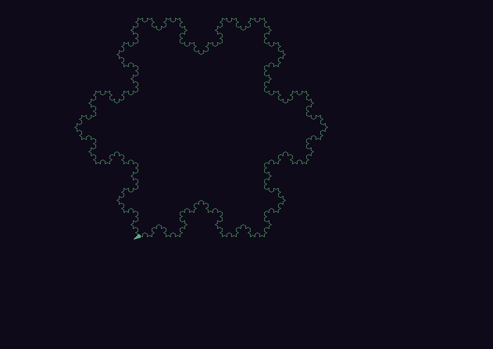

# Koch snowflake — empirical witness for (I, R) composability

A working composition of three independently-built systems renders a Koch
snowflake (and a sibling bushy-tree L-system): PRISM-IR declares the
workflow, 8OS hosts its execution as an (Intention, Resolution) graph, and
the simdecisions turtledraw adapter receives the terminal command stream
and draws to a canvas. None of the three systems was built knowing about
the others as a primary use case. The composition working at runtime is the
demonstration.

## Composing systems

| System | Role in the demo | Source |
|---|---|---|
| **PRISM-IR v1.1** | Declares the workflow as a Level-1 program: axiom, production rules, iteration loop, bracket-expansion pass, terminal emit. | [`deiasolutions/prism-ir`](https://github.com/deiasolutions/prism-ir) (language spec) |
| **8OS v1.1.0-dev.6** | Hosts the workflow as an (I, R) graph. Materializes the program into kernel records via a registered decomposer; the factory walks the records in topological order; resolution events are recorded on the kernel's tier-3 ledger. | [`deiasolutions/8os`](https://github.com/deiasolutions/8os) at tag `v1.1.0-dev.6` |
| **simdecisions turtledraw EGG** | Receives the flat turtle command stream and renders to a webpage canvas (React + p5.js, hosted in the simdecisions Shell pane host). | [`deiasolutions/simdecisions`](https://github.com/deiasolutions/simdecisions) |

The composition is bridged at the demo edge by Playwright: a 150-line
resolver opens a headless Chromium against the simdecisions dev server,
fills the canvas pane's command-input field, and screenshots the result.
No upstream changes were made to any of the three composing systems.

## The PRISM-IR program

The program is a single PRISM-IR v1.1 Level-1 file at
[`prism/koch-snowflake.prism.md`](../prism/koch-snowflake.prism.md):

```yaml
v: 1.1.0
prism: koch-snowflake
conformance: level-1

params:
  axiom: "X"
  rules:
    X: "F+[[X]-X]-F[-FX]+X"
    F: "FF"
  target_iterations: 6
  angle_degrees: 25
  forward_step_px: 4
  start_x: 320
  start_y: 700
  start_heading_degrees: -90

nodes:
  - { id: start,           t: start }
  - { id: seed,            t: task,     o: { op: script, resolver: lsystem-seed } }
  - { id: apply_rules,     t: task,     o: { op: script, resolver: lsystem-apply-rules } }
  - { id: iter_check,      t: decision, cond: "lstate.iteration < params.target_iterations" }
  - { id: expand_brackets, t: task,     o: { op: script, resolver: lsystem-expand-brackets } }
  - { id: emit_to_canvas,  t: task,     o: { op: script, resolver: lsystem-emit-to-canvas } }
  - { id: end,             t: end }

edges:
  - { s: start,           t: seed }
  - { s: seed,            t: apply_rules }
  - { s: apply_rules,     t: iter_check }
  - { s: iter_check,      t: apply_rules,     c: 'lstate.iteration < params.target_iterations' }
  - { s: iter_check,      t: expand_brackets, c: 'lstate.iteration >= params.target_iterations' }
  - { s: expand_brackets, t: emit_to_canvas }
  - { s: emit_to_canvas,  t: end }
```

The program declares a back-edge for iteration. PRISM-IR's `t: decision`
node carries the loop predicate; the back-edge from `iter_check` to
`apply_rules` is the cycle. Every operator is `op: script`. No LLM is
referenced anywhere in the program.

## The decomposer slot, filled deterministically

8OS does not parse PRISM-IR directly. The kernel's existing pattern,
established by Block 3's SCAN demo, is to register a **decomposer
resolver** that reads a PRISM-IR document body and emits a graph
specification the kernel's materializer authors as (I, R) records. The
factory's walker then processes those records uniformly with any other
(I, R) graph. The decomposer slot is *part of the kernel's resolver
machinery* — it is not a kernel feature dedicated to PRISM-IR.

Block 3's SCAN demo filled this slot with an LLM-bridged decomposer
([`src/eightos/factory/decomposer.py`](https://github.com/deiasolutions/8os/blob/v1.1.0-dev.6/src/eightos/factory/decomposer.py))
that crosses to the Anthropic Messages API, sends the PRISM-IR body
under a vendored prompt, and parses the LLM's JSON reply as a graph
spec.

The L-system demo fills the same slot with a **deterministic in-process
Python translator**
([`harness/resolvers/prism_decomposer.py`](../harness/resolvers/prism_decomposer.py)).
It reads the PRISM-IR YAML body directly, classifies edges into
forward/back by source-order topology, traces the loop body chain,
unrolls the back-edge using the program's declared
`params.target_iterations`, and emits a graph spec of nine nodes
(`seed`, six `apply_rules-iter-N` instances, `expand_brackets`,
`emit_to_canvas`) chained by `depends_on`.

**This is the architectural claim the demo cashes out.** Two demos
exercise the same decomposer slot with different fills (LLM, in-process
deterministic). The slot is not LLM-shaped; it accepts any resolver
that produces a graph spec from an intention body. A demo using a fresh
non-Python toolchain in this slot would compose the same way; the slot
is the load-bearing structure, not the decomposer's specific
implementation.

## The (I, R) graph

The decomposer's graph spec, after unrolling six iterations, materializes
nine kernel-hosted records under `8os/ir/lsystem/koch-snowflake.prism/`:

```
_node.md                       (root, expanded after decomposition)
seed.md                        depends_on: []
apply_rules-iter-0.md          depends_on: [seed]
apply_rules-iter-1.md          depends_on: [apply_rules-iter-0]
apply_rules-iter-2.md          depends_on: [apply_rules-iter-1]
apply_rules-iter-3.md          depends_on: [apply_rules-iter-2]
apply_rules-iter-4.md          depends_on: [apply_rules-iter-3]
apply_rules-iter-5.md          depends_on: [apply_rules-iter-4]
expand_brackets.md             depends_on: [apply_rules-iter-5]
emit_to_canvas.md              depends_on: [expand_brackets]
```

Each record carries the standard 8OS frontmatter (id, scope, tier,
status, depends_on, parent, authored_by, authored_via, authored_on, …)
plus a `prism_operator` YAML block in its intention body capturing the
PRISM-IR `op:` declaration. The records are 8OS-typed; nothing in their
shape is L-system-specific. The kernel's read ops, the factory's
walker, the resolution events — all of it works on these records the
same way it works on the SCAN demo's records and any other workload's.

## The trace

Resolutions land in topological order, one leaf per tick:

```
[tick 0]  decomposer fires on root → 9 children materialized
[tick 1]  seed                                  ✓ (axiom seeded; iter=0)
[tick 2]  apply_rules-iter-0                    ✓ (1 → 18 chars)
[tick 3]  apply_rules-iter-1                    ✓
[tick 4]  apply_rules-iter-2                    ✓
[tick 5]  apply_rules-iter-3                    ✓
[tick 6]  apply_rules-iter-4                    ✓
[tick 7]  apply_rules-iter-5                    ✓ (→ 25,159 chars)
[tick 8]  expand_brackets                       ✓ (→ 27,725 commands, 303,029 chars)
[tick 9]  emit_to_canvas                        ✓ (canvas rendered, PNG written)
```

Per-tick wall-clock from the publishable run:

> _Filled in from the published run; placeholder until Piece 4 completes._
>
> | Tick | Resolver | Wall-clock |
> |---:|---|---:|
> | 0 | lsystem-prism-decomposer | _PLACEHOLDER_ ms |
> | 1 | lsystem-seed | _PLACEHOLDER_ ms |
> | 2-7 | lsystem-apply-rules (×6) | _PLACEHOLDER_ ms each |
> | 8 | lsystem-expand-brackets | _PLACEHOLDER_ ms |
> | 9 | lsystem-emit-to-canvas | _PLACEHOLDER_ ms |
> | **Total** | | _PLACEHOLDER_ s |

## Real numbers

| Quantity | Value |
|---|---:|
| Iterations | 6 |
| Axiom length | 1 char |
| String length after iteration 6 | **25,159 chars** |
| Flat command count after bracket expansion | **27,725 commands** |
| Flat command stream length | **303,029 chars** |
| Anthropic API spend | **$0** (deterministic decomposer; no bridge crossing in the workflow) |
| Chunked emit | **yes** — command stream exceeds the 30 000-char single-shot threshold by 10×; the harness sends ~15 chunks of ~20 000 chars each, breaking only on `;` boundaries |

The chunking branch in the emit-to-canvas resolver was budgeted
defensively before the run; the dry-run made it load-bearing. The actual
chunk count from the publishable run is _PLACEHOLDER_; whether the
single-shot or chunked path was taken is logged in the resolver's
`resolution_value.chunking` field on disk.

## Rendered output



> _Image filled in from the published run; placeholder until Piece 4 completes._

The PNG is written by the emit-to-canvas resolver via Playwright's
`canvas.screenshot()` against `<canvas>` inside
`<div class="tdraw-canvas-container">` in the simdecisions Shell pane
host (class `hhp-root`). The viewport is 1280×1000; the canvas region
is the full pane.

## Reproduce

The demo runs against pinned versions of all three composing systems.
Tag and commit references resolve on the `deiasolutions` GitHub remote:

| System | Pin |
|---|---|
| 8OS binary | tag `v1.1.0-dev.6` (commit `315de79`); demo registration commit `f195857` |
| lsystem-demo | _PLACEHOLDER — final run commit_ |
| simdecisions | _PLACEHOLDER — commit at run time_ |

Steps:

```bash
# 1. Clone all three
mkdir -p ~/lsystem-demo-run && cd ~/lsystem-demo-run
git clone https://github.com/deiasolutions/8os.git
git clone https://github.com/deiasolutions/lsystem-demo.git
git clone https://github.com/deiasolutions/simdecisions.git

# 2. Pin to the published versions
( cd 8os && git checkout v1.1.0-dev.6 )
( cd lsystem-demo && git checkout <PLACEHOLDER> )
( cd simdecisions && git checkout <PLACEHOLDER> )

# 3. Install the kernel + harness as editable Python packages
( cd 8os && uv venv && uv pip install -e . )
( cd 8os && uv pip install -e ../lsystem-demo )
( cd 8os && .venv/bin/playwright install chromium )

# 4. Start the simdecisions dev server in a separate terminal
( cd simdecisions/browser && npm install && npm run dev )

# 5. Run the demo
( cd 8os && .venv/bin/python ../lsystem-demo/harness/run_demo.py )
```

The harness writes the rendered PNG to
`lsystem-demo/output/koch-snowflake.png` and prints the per-tick trace
to stdout.

## Friction surfaced and fixed

Two small bugs surfaced during initial dry-run; both were committed
before the publishable run. They are recorded here so the trace above
matches the artifacts on disk and the reader is not surprised:

- `kernel.reindex` requires `mode: "full"` in its input; the harness
  was passing `{}`. Schema validation rejected it. Fix:
  [`296f410`](https://github.com/deiasolutions/lsystem-demo/commit/296f410).
- The root record needed `domain: lsystem-prism-decomposer` in its 8OS
  frontmatter for the kernel selector to find a matching resolver. Fix:
  [`44c7990`](https://github.com/deiasolutions/lsystem-demo/commit/44c7990).
  Mirrors the SCAN demo's pattern at
  [`8os/ir/dogfood-scan/scan-daily-briefing/_node.md:8`](https://github.com/deiasolutions/8os/blob/v1.1.0-dev.6/ir/dogfood-scan/scan-daily-briefing/_node.md#L8)
  which declares `domain: prism-ir-decomposition` for the same reason.

Neither fix touches the kernel; both are demo-side. The 8OS binary is
the v1.1.0-dev.6 release verbatim.

## What this demo witnesses (and what it does not)

This demo witnesses **composability under multi-system runtime
composition** — that the (I, R) primitive carries enough architectural
weight to bridge three systems built independently, on different
timelines, for different primary purposes. The empirical witness is the
trace above and the rendered image: the program ran, the graph
walked, the canvas drew.

This demo does **not** witness:

- PRISM-IR's expressive coverage of the 43 Workflow Patterns. That is a
  separate formal claim made by the
  [PRISM-IR project](https://github.com/deiasolutions/prism-ir), evidenced
  by the spec's pattern-coverage tests.
- 8OS's eight-axiom kernel ABI. That is a separate structural claim of
  [the 8OS project](https://github.com/deiasolutions/8os), evidenced by
  the kernel spec at `docs/spec/8OS-KERNEL-SPEC-v0.1.md` and the test
  suite that runs against it.
- The simdecisions turtledraw EGG's coverage of all turtle-graphics
  surfaces. The contract this demo runs against is at
  [`docs/adapter-contract.md`](./adapter-contract.md); other surfaces
  are out of scope here.

The demo's claim is narrower than any of those, and is the one this
artifact actually establishes.
